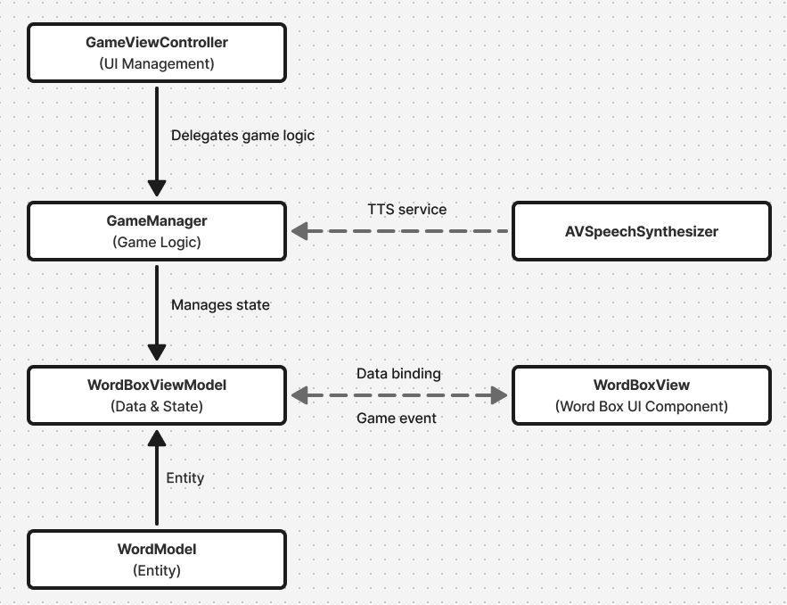

# Word-Scape-Game-Development-Challenge

This project fulfills the requirements for:
- **Tier 1:** Basic functionality with dynamic word movement and user interaction to capture escaping words. The design and functionality follow the provided example on the webpage.
- **Tier 3:** Enhanced gameplay with **Text-to-Speech (TTS)** support using `AVSpeechSynthesizer` to utter words that escape.

## Demo

  

## Main Features
- Dynamic word movement across lanes with random speeds.
- Responsive word movement speed, adapting to device screen size.
- Tap-to-capture mechanism with display in **Captured words** label.
- Words that reach the finish line are uttered via Text-to-Speech (TTS).

## Architecture & Design

  

The project follows the **MVVM (Model-View-ViewModel)** design pattern:
- **Model (`WordModel`)**: Handles the core data structure for each word: text, speed.
- **ViewModel (`WordBoxViewModel`)**: Manages the state and game logic for word movement and captures and serves as a bridge between the View and Model.
- **View (`WordBoxView`)**: Represents the UI element for each word box, responding to state changes from the ViewModel.
- **Controller (`GameViewController`)**: Handles UI management, user interactions, and delegates game logic to the `GameManager`.
- **GameManager**: Controls the game loop, state transitions, and interactions with the TTS service.

### Libraries & Frameworks Used
- **UIKit**: For building the user interface.
- **AVFoundation**: AVSpeechSynthesizer To implement TTS functionality.

## Generative AI Policy Acknowledgment

As per **Generative AI Policy** section in the instruction, this project acknowledges the use of **Generative AI as a thought-partner** during the development process.

### **AI Use Case:**
- **Design Planning:** Provided assistance in structuring the MVVM architecture and validating the relationships between `Controller`, `ViewModel`, and `View`. 

> **IMPORTANT:** The core design decisions were made independently by the developer, with AI support serving as a supplementary resource for refining and validating ideas.
